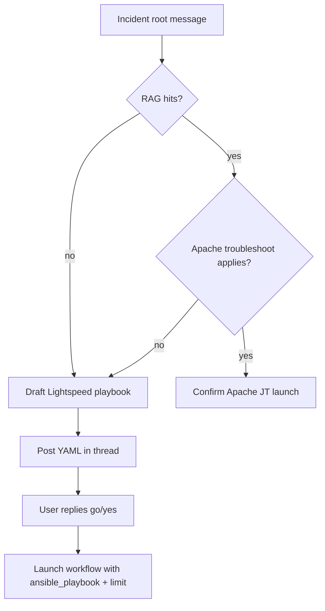

## Problem

When an incident notification arrives in chat, the bot should support two remediation paths:

1. **Apache troubleshoot** — when a matching KB runbook exists and the incident text indicates an Apache application outage, launch the configured troubleshoot job template.
2. **Ansible Lightspeed remediation** — when no dedicated KB runbook applies (or the user indicates a different issue), draft a remediation playbook via the Ansible Lightspeed API, present the YAML in-thread for review, then launch the configured workflow with `ansible_playbook` and `limit` extra vars.

Today upstream itsm-agent only has a simple deterministic incident confirmation reply. The AIOps demo patches a full Lightspeed flow with LiteLLM fallback when Lightspeed returns 401/404/503.

## Depends on

Reliable `vm_name` extraction from incident bodies (see separate issue for `bot/knowledge.py` `parse_incident_from_body()` fix).

## Proposed enhancement

### New file: `bot/lightspeed_remediation.py`

Reference implementation (~362 lines):

https://github.com/zaskan/aiops/blob/main/roles/demo_platform/files/itsm_agent/bot/lightspeed_remediation.py

Responsibilities:

- Read Lightspeed / routing config from env
- `apache_troubleshoot_path_applies()` — route Apache incidents to the troubleshoot JT when KB + incident text match
- `resolve_incident_template()` — choose Apache troubleshoot JT vs Lightspeed workflow
- `generate_remediation_playbook()` — POST to Lightspeed API; optional LiteLLM fallback
- `ensure_lightspeed_playbook_in_collected()` — populate `ansible_playbook` and `limit` before launch
- Chat reply helpers: playbook review, generation failure, incident confirmation

### Patch: `bot/runner.py`

Integrate Lightspeed flow into root message handling, thread follow-ups, launch readiness, and `_launch_in_background`:

- On incident root messages with no RAG hits → draft Lightspeed playbook immediately
- On incident root messages when Apache troubleshoot KB does not apply → Lightspeed path
- `_present_lightspeed_playbook()` helper posts YAML for user review
- Incident launches require explicit `go` / `yes` confirmation
- Lightspeed workflow launch waits for `ansible_playbook` in collected fields

Full patch file: https://github.com/zaskan/aiops/blob/main/roles/demo_platform/files/itsm_agent_runner_lightspeed.patch

### New configuration (env / `k8s/secret_template.yaml`)

| Variable | Description | Default |
|----------|-------------|---------|
| `AAP_LIGHTSPEED_WORKFLOW` | AAP workflow template name for Lightspeed remediation | `Lightspeed Remediation` |
| `AAP_LIGHTSPEED_API_URL` | Lightspeed playbook generation endpoint | (required for Lightspeed path) |
| `AAP_LIGHTSPEED_API_TOKEN` | Bearer token for Lightspeed API | (required for Lightspeed path) |
| `AAP_LIGHTSPEED_TLS_VERIFY` | TLS verify for Lightspeed HTTP client | `true` |
| `AAP_LIGHTSPEED_ALLOW_LITELLM_FALLBACK` | Fall back to LiteLLM when Lightspeed unavailable | `true` |
| `AAP_APACHE_TROUBLESHOOT_JT` | Job template name for Apache troubleshoot path | `Troubleshoot apache application` |
| `ITSM_KB_APACHE_TROUBLESHOOT_TITLE` | KB title that triggers Apache troubleshoot routing | `Troubleshoot Apache application down alert` |

Existing `LLM_BASE_URL`, `LLM_MODEL`, and `LLM_API_KEY` are used only for LiteLLM fallback playbook generation.

## Flow

## AIOps workaround

Patched at image build in `roles/demo_platform/tasks/build_itsm_agent_image.yml`:

- `roles/demo_platform/files/itsm_agent/bot/lightspeed_remediation.py`
- `roles/demo_platform/files/itsm_agent_runner_lightspeed.patch`
- `roles/demo_platform/files/itsm_agent_knowledge_incident.patch` (vm_name parsing; filed separately)

Toggle: `itsm_agent_lightspeed_remediation_patch` in `group_vars/all/itsm_agent.yml`

Reference tree: https://github.com/zaskan/aiops/tree/main/roles/demo_platform/files/itsm_agent
